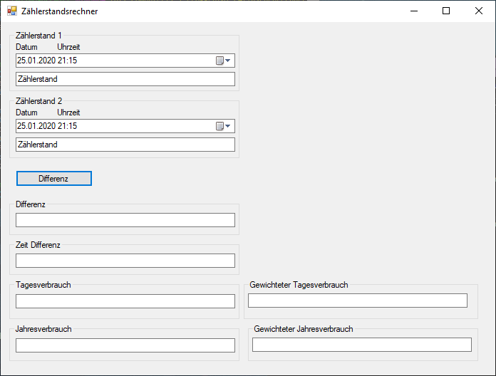

# Zählerstandsberechnung    

Dies ist ein Programm, welches die Differenz zwischen zwei Zählerstände berechnet.
Das Programm entstand im Schulpraktikum im Jahr 2014.

Um das Programm zu starten, führen Sie die "Zählerstandsberechnung.exe" aus.

